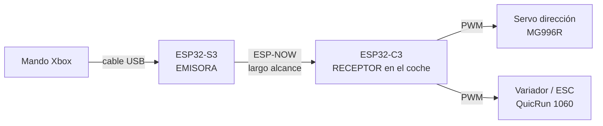

```
████████╗ ██╗  ██╗
╚══██╔══╝ ╚██╗██╔╝
   ██║     ╚███╔╝
   ██║     ██╔██╗
   ██║    ██╔╝ ██╗
   ╚═╝    ╚═╝  ╚═╝
   E M I S O R A  ·  el lado que va en tu mano
```

# 🎮 ESP32 RC Transmitter · EMISORA (TX)

Una emisora casera para coches de radiocontrol que usa un mando de Xbox, pero con
el alcance de verdad que necesita un RC.

En lugar de conectar el mando por Bluetooth directamente al coche, aquí el mando
se enchufa por USB a un **ESP32-S3** que hace de emisora, y esa emisora habla con
el coche por **ESP-NOW**, el protocolo de radio de Espressif. El resultado:
cientos de metros de alcance en vez de cinco.

> Este repositorio es la **emisora** (el transmisor). El coche lleva un segundo
> ESP32, un **ESP32-C3**, que recibe las órdenes y mueve el variador y el servo. Su
> código vive en su propio repo: **[ESP32Receiver (RX)](https://github.com/Placix5/ESP32Receiver)**.
> Los dos tienen que estar flasheados para que el coche ande.

---

## El problema que resuelve

La primera versión de esto ([ESP32-RC-Controller](https://github.com/Placix5/ESP32-RC-Controller))
conectaba el mando de Xbox **directamente por Bluetooth** a un ESP32 dentro del
coche. Se conducía genial, pero el alcance real no pasaba de **5 metros** antes de
empezar a perder órdenes. Para un coche de RC, eso es no llegar a ningún sitio.

El Bluetooth está pensado para auriculares y teclados a un par de metros, no para
gobernar un coche por un aparcamiento. Así que cambié el enfoque: el mando ya no
habla con el coche, sino con una **emisora** que tienes en la mano, y esa emisora
llega hasta el coche por **ESP-NOW**, que tiene muchísimo más alcance.

En la práctica es como haberme construido una emisora de RC de verdad, solo que
el "joystick" es un mando de Xbox.

---

## Cómo funciona, de un vistazo



Coges el mando, lo enchufas por USB al ESP32-S3, y el S3 lee lo que haces
(sticks, gatillos, botones), lo convierte en tres números —**modo, motor y
dirección**— y los dispara por ESP-NOW al coche. El ESP32-C3 del coche traduce
esos números en señales para el servo y el variador. Todo ello **50 veces por
segundo** (50 Hz), a ritmo constante, así que se conduce sin lag perceptible.

---

## Qué hace

- **Mando de Xbox por USB** (One y Series, por cable).
- **Tres modos de conducción** — Eco, Normal y Sport — con distinto límite de gas
  y freno. Cambias de modo manteniendo **L1 + R1** dos segundos.
- **Aviso por vibración y color**: al cambiar de modo el mando vibra y el LED de
  la emisora cambia (🟢 Eco, 🔵 Normal, 🔴 Sport).
- **Dirección con trim y topes independientes**: ajustas por separado cuánto gira
  a cada lado y dónde quedan las "ruedas rectas", con zona muerta para que no se
  desvíe solo.
- **Envío constante a 50 Hz**: la emisora manda el último estado 50 veces por
  segundo, envíe o no reportes el mando, para que el coche note de verdad si se
  pierde la señal.
- **Failsafe en la emisora**: si desenchufas el mando, la emisora pasa a NEUTRO al
  instante (motor parado, ruedas rectas) y lo sigue enviando, así que el coche se
  detiene en el acto.
- **Enlace robusto y de largo alcance**: ESP-NOW en modo **Long Range** y sin
  ahorro de energía (menos latencia), apuntado directamente a la MAC del coche
  (*unicast*).
- **Paquete de solo 3 bytes** por ESP-NOW: menos latencia y más fiabilidad.

---

## Qué necesitas

**La emisora (este repo):** una placa **ESP32-S3** (es la que puede hacer de USB
Host), un mando de Xbox One/Series con cable USB, y el LED RGB integrado de la
placa.

**El coche (receptor, [repo aparte](https://github.com/Placix5/ESP32Receiver)):** una placa **ESP32-C3**, un variador ESC
(HobbyWing QuicRun 1060 o cualquiera estándar de 50 Hz) y un servo de dirección
(MG996R o similar).

La lista detallada y los avisos de alimentación están en
[**Requisitos y entorno**](docs/09-ENTORNO-ESP-IDF.md).

---

## Empezar

```bash
git clone https://github.com/Placix5/ESP32Transmitter.git
cd ESP32Transmitter
idf.py set-target esp32s3
idf.py build
idf.py -p PUERTO flash monitor
```

No hace falta `--recursive`: las librerías (TinyUSB y el driver XInput) vienen
incluidas en `components/`. ¿Primera vez con ESP32? Empieza por
[**Requisitos y entorno**](docs/09-ENTORNO-ESP-IDF.md) para dejar ESP-IDF y VSCode
listos, y sigue con [**Puesta en marcha**](docs/10-PUESTA-EN-MARCHA.md), que además
te lo explica todo con botones, sin tocar la terminal.

---

## 📚 Documentación

Este repo no es solo para clonarlo: es para **entender** lo que hace. La
documentación está pensada para que aprendas los conceptos aunque no hayas tocado
un microcontrolador antes. Empieza por el índice:

### → [**Ir a la documentación**](docs/README.md)

Un adelanto de lo que encontrarás:

| Sección | De qué trata |
|---------|--------------|
| [Por qué existe](docs/01-POR-QUE-EXISTE.md) | La historia del alcance y la idea de partir el sistema en dos. |
| [Arquitectura del sistema](docs/02-ARQUITECTURA-DEL-SISTEMA.md) | Por qué dos ESP32 y el viaje de una orden de tu pulgar a las ruedas. |
| [Leer el mando](docs/03-LEER-EL-MANDO.md) | USB Host, XInput y TinyUSB (y el parche que hubo que hacer). |
| [Comunicación ESP-NOW](docs/04-COMUNICACION-ESP-NOW.md) | Por qué gana al Bluetooth y qué viaja en el paquete de 3 bytes. |
| [Lógica de conducción](docs/05-LOGICA-DE-CONDUCCION.md) | Zona muerta, mapeo de valores y los tres modos. |
| [PWM](docs/06-PWM.md) | Cómo un número acaba moviendo un servo y un motor. |
| [FreeRTOS y núcleos](docs/07-FREERTOS-Y-NUCLEOS.md) | Tareas, los dos núcleos del S3 y el arranque del USB. |
| [El receptor](docs/08-EL-RECEPTOR.md) | Qué hace el ESP32-C3 del coche. |
| [Requisitos y entorno](docs/09-ENTORNO-ESP-IDF.md) | Hardware necesario e instalar ESP-IDF en VSCode paso a paso. |
| [Puesta en marcha](docs/10-PUESTA-EN-MARCHA.md) | Compilar, flashear y conducir (con los botones de VSCode). |
| [Adaptarlo a tu coche](docs/11-ADAPTARLO-A-TU-COCHE.md) | Ajustes y calibración para tu chasis. |
| [Hoja de ruta](docs/12-HOJA-DE-RUTA.md) | Lo que falta y en qué puedes ayudar. |

---

## Créditos y licencia

Este proyecto se apoya en dos librerías estupendas, incluidas en `components/`
con su licencia original (MIT):

- [**TinyUSB**](https://github.com/hathach/tinyusb) — la pila USB que permite al
  ESP32-S3 hacer de Host y leer el mando.
- [**tusb_xinput**](https://github.com/Ryzee119/tusb_xinput) de Ryzee119 — el
  driver que entiende el protocolo XInput de los mandos de Xbox.

El código de este repositorio se publica bajo licencia MIT. Úsalo, rómpelo,
modifícalo y comparte lo que aprendas.
