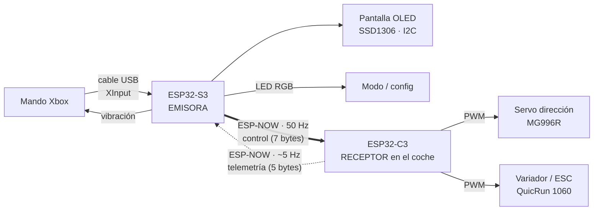

# 2. Arquitectura del sistema

## Por qué dos ESP32 distintos (S3 y C3)

Aquí mucha gente se pregunta: *"¿Por qué no usas el mismo chip en los dos
lados?"*. Porque cada mitad tiene un trabajo distinto y cada chip está mejor para
una cosa.

Primero, un momento para lo básico: **un ESP32 es un ordenador entero dentro de
un chip**. Procesador, memoria y un montón de periféricos, todo en unos pocos
milímetros cuadrados y por unos pocos euros. La diferencia con tu portátil es que
no tiene un sistema operativo pesado corriendo por encima; ejecuta *tu* programa
y poco más, de forma directa y predecible. Eso es justo lo que quieres cuando de
tu código depende que un coche no se estampe.

Dentro de la familia ESP32 hay varios modelos, y aquí uso dos:

- **ESP32-S3 (la emisora).** Su superpoder para este proyecto es que puede hacer
  de **USB Host**. Es decir, puede comportarse como el ordenador al que enchufas
  el mando, darle corriente y hablar con él. Esto es imprescindible para leer un
  pad de Xbox por cable, y no todos los ESP32 saben hacerlo.
- **ESP32-C3 (el receptor).** Es más pequeño, más barato y consume menos. No
  necesita leer ningún mando; solo escuchar la radio y mover dos cosas. Perfecto
  para ir escondido dentro del coche sin ocupar sitio ni gastar batería.

Resumiendo: el S3 porque sabe leer el mando; el C3 porque para el coche va
sobrado.

## El viaje de una orden: de tu pulgar a las ruedas

Antes de meternos en cada tecnología por separado, sigamos una sola orden de
principio a fin. Imagina que empujas el stick izquierdo hacia la derecha para
girar.

1. **Tu pulgar mueve el stick.** Dentro del mando, ese movimiento se convierte en
   un número entre -32768 y +32767. Centrado es 0; todo a la derecha es +32767.
2. **El S3 lee ese número** por USB, muchas veces por segundo, gracias a TinyUSB
   y al driver de XInput.
3. **El S3 hace cuentas.** Descarta el ruido si el stick está casi centrado
   (la zona muerta), y convierte ese -32768...+32767 en un ángulo de servo cómodo,
   dentro de los topes que hayas fijado (ajustables a cada lado por separado y
   **en caliente**, sin recompilar).
4. **Empaqueta el resultado** junto con el valor del motor, el modo actual y una
   **marca de tiempo** en un paquetito de 7 bytes.
5. **Lo dispara por ESP-NOW.** El paquete sale por la antena Wi-Fi del S3.
6. **El C3 del coche lo recibe.** Saca los tres números del paquete.
7. **El C3 genera dos señales PWM:** una le dice al servo "ponte a 108 grados" y
   otra le dice al variador cuánta caña meter.
8. **El servo gira y el coche tuerce.** Fin del viaje.

Todo esto, de tu pulgar a la rueda, ocurre en milisegundos y se repite **50 veces
por segundo** (50 Hz), a ritmo constante. Por eso la conducción se siente inmediata.

## El viaje de vuelta: la telemetría

Hay un segundo camino, más tranquilo, en sentido contrario. Antes la radio iba
solo de la emisora al coche, y eso dejaba la pregunta más incómoda sin
responder: *¿le está llegando de verdad?*

Ahora el coche contesta, unas **5 veces por segundo** (mucho menos que el
control: es información de apoyo, no hay que malgastar radio en ella):

1. El coche **devuelve la marca de tiempo** que venía en el paquete de ida, tal
   cual, sin tocarla.
2. Añade el **RSSI**: con cuánta fuerza le está llegando la señal.
3. La emisora recibe eso y hace una resta: la hora de ahora menos la marca que
   acaba de volver. Eso es la **latencia de ida y vuelta**, el "ping".
4. Y lo pinta todo en la **pantalla OLED**: ping, barritas de cobertura, modo,
   gas y dirección.

El truco de la marca de tiempo es más listo de lo que parece: como la emisora
compara **su propio reloj consigo mismo**, no hace falta que las dos placas tengan
la hora sincronizada. Está explicado en
[Comunicación ESP-NOW](04-COMUNICACION-ESP-NOW.md).

## El sistema completo, con los dos sentidos

Fíjate en el grosor de las flechas de radio: la gruesa es el **control**, el flujo
constante de 50 Hz del que depende que el coche obedezca. La de puntos es la
**telemetría**, que va a su aire y que si se pierde no afecta a la conducción,
solo a lo que ves en la pantalla.

En las siguientes secciones abrimos cada tramo del viaje: primero cómo se lee el
mando, luego cómo se manda la orden al coche y cómo vuelve la telemetría.

---

« [Anterior: Por qué existe](01-POR-QUE-EXISTE.md) · [📚 Índice](README.md) · [Siguiente: Leer el mando »](03-LEER-EL-MANDO.md)
